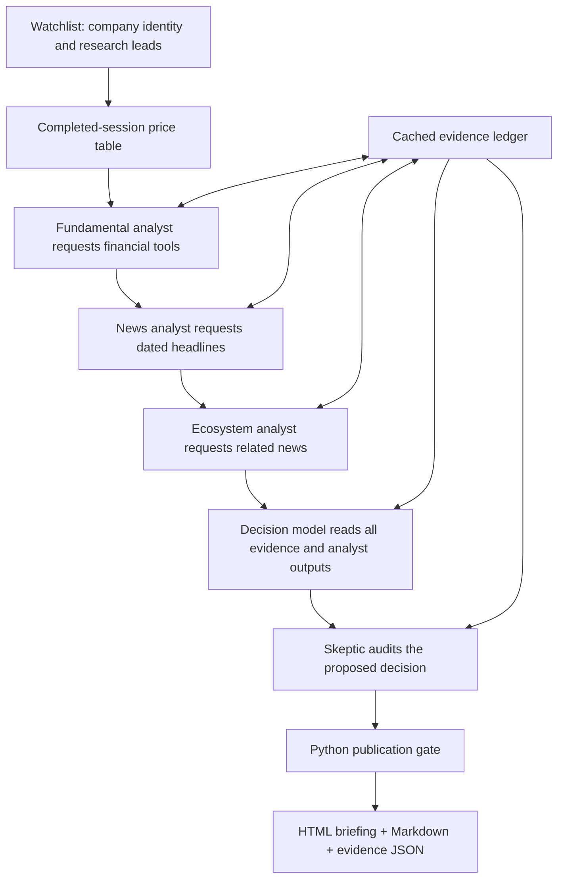

# Your daily research desk

This is a self-contained teaching implementation requested on 2026-09-08. It shows the complete flow in ordinary Python files. It does not replace the separately planned six-module rebuild at the repository root. Start by reading `main.py`, then run the fictional demo and inspect its table and individual analyst notes.

The intended result is a daily briefing you can read over breakfast: completed-session prices, direct news, possible indirect effects, a clear research stance, and the reason that stance could be wrong. A strong model supplies judgment; Python performs calculations and enforces publication conditions.

## Try the entire flow without keys or market calls

From the repository root in PowerShell:

```powershell
python -m venv full-flow/.venv
.\full-flow\.venv\Scripts\python.exe -m pip install -r full-flow/requirements.txt
.\full-flow\.venv\Scripts\python.exe full-flow/main.py --demo
```

This downloads Python dependencies, but the demo itself performs no network requests. `tzdata` supplies IANA timezones on Windows. Dependencies have already been installed into the isolated `.venv` in this working copy during implementation.

Open the HTML path printed by the command. The Markdown file is readable in an editor; the JSON file retains the evidence and model outputs for inspection. All output is under `full-flow/reports/`. DEMO filenames, banners, source labels and table actions identify fictional output. Its BUY/SELL examples are scripted demonstrations, not analysis of the real companies. Live and demo history are kept separate. The report-folder ignore rule was removed by a concurrent edit during implementation and was preserved; check Git ignore settings before saving or committing personal live research.

Try a smaller watchlist:

```powershell
.\full-flow\.venv\Scripts\python.exe full-flow/main.py --demo --only acushnet samsung NVDA
```

## How the pieces connect



An agent here is a role prompt plus a bounded tool loop. It asks for an allowed function, Python executes it, and the result returns to the model under the correct call ID. That continues until the model produces validated JSON or the run fails explicitly. There is no CrewAI dependency, autonomous conversation between agents, or broker connection.

| File | What to learn from it |
|---|---|
| `main.py` | The entire order of work, including partial failures |
| `watchlist.py` | Listed companies versus brands/leagues; research leads |
| `config.py` | Model routing, time horizon and bounds |
| `contracts.py` | Shared Python dataclasses connecting the modules |
| `providers.py` | Native OpenAI Responses, Claude Messages and Gemini sessions |
| `data_tools.py` | yfinance normalization, timestamps, evidence and valuation arithmetic |
| `agents.py` | Analyst prompts, dynamic tool execution and output validation |
| `guardrails.py` | Conditions that block an unsupported published stance |
| `report.py` | Table, analyst notes, evidence and changes since the last report |
| `demo.py` | Fictional data and scripted model responses using the real loop |
| `tests/test_flow.py` | Offline failure cases and native transport contracts |
| `run_daily.ps1` / `install_schedule.ps1` | Later daily execution through Windows Task Scheduler |

The full-flow directory and added modules are an explicit exception requested for this teaching example. The archive and root production plan remain separate.

## Your starting watchlist

Reviewed against sources listed in [SOURCES.md](SOURCES.md) on 2026-09-08. These are research subjects, not recommendations. Runtime code requires the quote to match the configured equity, company name, ticker and currency. Availability through Yahoo is not assumed from a listing announcement.

| What you know | Configured instrument | What you actually track |
|---|---|---|
| Titleist / FootJoy | `GOLF` | Acushnet, the listed parent |
| Callaway / Odyssey / TravisMathew / OGIO | `CALY` | Callaway Golf; old MODG assumptions can be stale |
| Samsung Electronics | `005930.KS` | Korean ordinary shares, KRW |
| NVIDIA | `NVDA` | US-listed equity, USD |
| Google | `GOOGL` | Alphabet Class A, USD |
| Apple | `AAPL` | US-listed equity, USD |
| Adobe | `ADBE` | US-listed equity, USD |
| Tesla | `TSLA` | US-listed equity, USD |
| SpaceX | `SPCX` | IPO announcement names this ticker; verify current identity at runtime |
| PGA TOUR / PGA TOUR Enterprises | No direct ticker configured | Golf industry news; commercial equity interests differ from buying listed shares |
| LIV Golf | No direct ticker configured | Industry news and financing developments |
| TGL / TMRW Sports | No direct ticker configured | League and private investment context |

People do invest in private companies, commercial ventures and sports teams. That is different from an ordinary brokerage purchase of a listed stock. This example does not provide private-market access. Nor does buying a sponsor give you ownership of the sponsored league. Cobra/PUMA is another useful research direction; PUMA's golf exposure sits within a broader business, so do not substitute its whole-company results for golf-segment results. No unverified ticker is added for that suggestion.

Supplier/customer/competitor tickers in `related` are deliberately labeled hypotheses. For example, semiconductor manufacturing, memory, networking, cloud capital spending and export policy can be useful lines of inquiry around NVIDIA. The model must verify the actual connection and its economic importance before presenting a direct supplier claim. A curated topic map is a starting search plan, not a discovered supply-chain database.

## Once daily is a reasonable start

Assuming your computer uses New Zealand time, start at **08:30**, then adjust after observing usefulness and cost. The regular US equity session closes at 16:00 New York time, which falls around 06:00-08:00 in Auckland across seasonal clock changes. 06:00 Auckland can therefore be before the US close. The code uses actual IANA timezone conversion and a 20-minute regular-close buffer; a current in-progress daily candle is excluded.

The table labels each session date. On weekends and holidays it can correctly retain the prior session rather than fabricate a new daily price. Its maximum calendar-age rule is a coarse safeguard, not a full exchange-calendar validator. On early-close days it conservatively waits until the usual close time before including that session. Korean data will refer to its own completed session. Adjusted closes calculate daily change across splits/dividends; the displayed price is the unadjusted close.

Running every few hours would often repeat the same statements and news while increasing API use. This example recomputes analyst notes on every live run. A practical later optimization is a small daily changes briefing plus fuller research after earnings or material developments. The JSON history already lets it show prior stance and newly covered news URLs, but it does not yet implement thesis-change reasoning or deduplicated paid analysis across runs.

## Connect real models when you choose

Copy `full-flow/.env.example` to `full-flow/.env` and fill in the keys for the selected provider. Both API access and billing are separate from this local example. Only the selected provider needs a key in single-provider mode. Account access to a named model has not been tested.

```powershell
# First real qualification should be one company and one provider.
.\full-flow\.venv\Scripts\python.exe full-flow/main.py --provider google --only GOLF

# Or use OpenAI or Claude throughout.
.\full-flow\.venv\Scripts\python.exe full-flow/main.py --provider openai --only GOLF
.\full-flow\.venv\Scripts\python.exe full-flow/main.py --provider claude --only GOLF

# Mix providers by role using full-flow/.env.
.\full-flow\.venv\Scripts\python.exe full-flow/main.py --provider mixed --only GOLF
```

Default mixed route: Claude handles fundamentals, Gemini handles news and ecosystem questions, OpenAI produces the decision, and Claude audits that draft. These assignments are editable examples, not evidence that one vendor is best at a particular job. You can swap the final decision to Claude and the skeptic to OpenAI. All providers receive the same retained tool evidence where relevant.

Default documented IDs: `gpt-6-astra`, `claude-fable-5-1`, `gemini-3.8-flash`. Exact IDs and account availability can change. A more capable model may be useful for synthesis and critique; it does not make unsupported inputs reliable. A role called skeptic is not a security boundary: Python restricts tool names and arguments, owns the request cap, and decides whether to publish the action.

Each public company uses five model roles; each role may take multiple requests. The example caps requests (default 300), turns (7), tool calls per turn (4), output tokens and evidence size. Provider automatic retries are disabled/bounded. A request ceiling is not an exact dollar ceiling: check current vendor pricing and use provider billing limits. Start with `--only GOLF` and a cheaper specialist model if needed before running the whole roster. Demo consumes zero paid requests.

## Clear recommendations with explicit boundaries

The decision has to state one action, its rationale, evidence and an observable invalidation condition. BUY means a conditional research candidate; HOLD means no new action if held, or continue watching if unheld; SELL means reduce/exit if held, or avoid if unheld. SELL never means shorting here. ABSTAIN means the workflow cannot support an action with its available evidence. CONTEXT ONLY is used for entities without a configured direct listing.

For BUY/SELL this teaching implementation requires a cited Python valuation calculation. Its simple formula is:

```text
future EPS = latest annual diluted EPS * (1 + assumed growth)^years
future share price = future EPS * assumed exit P/E
conditional present value = future share price / (1 + required return)^years
```

Growth, future P/E and required return are visible assumptions. The model explains them, and the skeptic can reject them or the method. This is a deliberately limited earnings-multiple method; it does not model dividends, dilution, foreign exchange, or a full cash-flow forecast. It can be inappropriate for peak-cycle earnings, negative earnings or a structurally changing business. The honest outcome in those cases can be ABSTAIN until a suitable method is added.

The default BUY gate additionally requires a 15% cushion between the conditional present value and the price. That is an editable teaching policy, not a validated investment strategy or promised margin of safety. SELL must be consistent with a selected value below price. No rule here has established outperformance.

A malformed response, unseen/failed evidence citation, stale/missing price, wrong company/currency, missing statements, failed analyst, or rejected skeptical review blocks the published stance. The raw draft remains visible with its failed status. The gate cannot prove that every sentence follows from its sources; its structural checks and another model's review are imperfect. Inspect material claims in original filings before relying on real output.

## News coverage and security limits

yfinance provides company headlines and sometimes summaries; its Search interface supplies additional configured queries. This is not a comprehensive web research service, full-article reader, verified supplier database, or exhaustive news alert. The code filters missing dates, old/future stories, non-HTTPS links and duplicate URLs. An empty result is a coverage limitation, not neutral sentiment or evidence that nothing happened.

The next meaningful source upgrade is original earnings releases/filings and authenticated source excerpts. For US issuers consider SEC EDGAR and investor relations; for Korea consider DART/OpenDART. Add those as evidence tools with source dates and passages, then test the claims they support. Swapping models alone does not provide those sources.

Only configured read-only tools run. Model text cannot choose arbitrary tickers, URLs, shell commands, files, credentials or recipients. API keys stay in `.env`; raw SDK exception strings are not written to reports. HTML escapes model/news text. Audit JSON contains research and model outputs, so treat your output folder as personal data if you later add portfolio information. No trading, messaging, email, broker integration or automatic portfolio mutation is implemented.

## Schedule later, after reviewing live output

The report arrives as local files. An email or app delivery adapter is a later addition once you choose a destination; it is not silently configured here. The scheduler scripts were written and syntax-checked, not installed or executed as recurring jobs.

```powershell
# Preview configuration only:
.\full-flow\install_schedule.ps1 -At 08:30 -Provider google

# Explicitly register later, after a successful one-company live run:
.\full-flow\install_schedule.ps1 -At 08:30 -Provider google -Install
```

Task Scheduler uses the Windows system timezone, not the report display timezone. Ensure the machine is on, check account/logon and sleep settings, and inspect the run logs. The task prevents overlapping scheduled instances and never overwrites an existing task with the same name. It generates all configured watchlist entries; edit the watchlist for routine use. An ABSTAIN or partial failure still produces files and can return exit code 1. Setup/output failure returns 2.

## Verification and next steps

```powershell
.\full-flow\.venv\Scripts\python.exe -m unittest discover -s full-flow/tests -v
.\full-flow\.venv\Scripts\python.exe full-flow/main.py --demo --quiet
```

See [VERIFICATION.md](VERIFICATION.md) for checks actually performed. No paid model API or live Yahoo data request was made during implementation. Mocked adapters demonstrate the request/result mechanics, not account access or live model compliance.

Use the demo to understand the flow, inspect `analyze_company`, then run one live ticker with one provider when ready. Audit that report before scheduling. Later add primary filings, better valuation methods, persistent thesis comparisons and portfolio context in that order according to your needs. Keep a dated record of mistakes and missing evidence; evaluate factual accuracy separately from subsequent stock returns.
